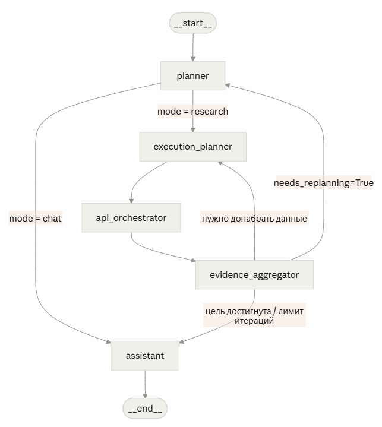

# NKRJA Research Agent

**MVP** автономного исследовательского агента для работы с **Национальным корпусом русского языка (НКРЯ)**.
Агент на базе LLM на основе запроса пользователя формулирует цель, выбирает подходящий корпус, планирует и выполняет батчи вызовов к API НКРЯ, агрегирует полученные данные в проверяемые факты и формирует итоговый ответ пользователю.

Построен на **LangGraph** : весь цикл *спланировать - выполнить - проверить - доисследовать / ответить* реализован как граф состояний


## Архитектура



### Узлы графа


 **planner**  Определяет режим работы (`mode="research"` / `mode="chat"`), формулирует цель исследования, гипотезы, пошаговый `research_plan` и выбирает подходящий корпус НКРЯ (`recommended_corpus`) с обоснованием. |
 **execution_planner**  На основе цели, плана и уже собранных фактов формирует **батч** независимых вызовов инструментов (`planned_actions`), которые можно выполнить за один проход. 
 **api_orchestrator**  Выполняет весь батч вызовов к `NKRJAClient`, отфильтровывая заведомо несовместимые комбинации `corpus` / `resultType` до похода в API, и складывает сырые ответы в `evidence`
 **evidence_aggregator**  Анализирует пакет сырых данных, извлекает из него человекочитаемые `facts`, решает - достигнута ли цель, нужно ли донабрать инструменты по тому же плану, либо методология в целом неверна (`needs_replanning`). 
 **assistant**  Финальный узел: на основе накопленных `facts` пишет структурированный ответ пользователю в markdown

### Ключевые механизмы

- **Режим research / chat** - если пользователь задаёт уточняющий вопрос по уже собранным фактам, `planner` переводит граф сразу к `assistant`, минуя дорогостоящий цикл обращений к API. Память между вопросами внутри одной CLI-сессии обеспечивает `MemorySaver` - LangGraph checkpointer по `thread_id`
- **Батч-исполнение инструментов** - `execution_planner` может запланировать сразу несколько независимых вызовов API за одну итерацию вместо вызова "по одному".
- **Три исхода после агрегации доказательств**:
  - цель достигнута - `assistant`;
  - обычная («оранжевая») петля - нужно просто вызвать ещё инструменты по тому же плану -`execution_planner`;
  - редкая («красная») петля - сама методология (корпус/цель/план) неверна - полный возврат к `planner`.
- **Предохранитель от бесконечных циклов** -  лимит `max_iterations = 4` в `evidence_router`, принудительно завершающий исследование даже если цель не достигнута.
- **Защитный слой в оркестраторе** - до вызова API отфильтровываются комбинации `corpus` + `resultType`, не входящие в `RESULTTYPE_CORPUS_WHITELIST`, чтобы не тратить запросы впустую на несовместимые связки.
- **Маппинг тема - корпус** - `planner` выбирает один из корпусов НКРЯ (`POETIC`, `SPOKEN`, `OLD_RUS`, `BLOGS`, `CLASSICS`, `KIDS`, `MAIN` и др.) исходя из формулировки вопроса.

---

## Структура проекта

```
.
├── graph.py                  # Точка входа: сборка LangGraph, CLI-цикл, чекпоинтер
├── app/
│   └── config.py              # Загрузка NKRJA_API_KEY / VSEGPT_API_KEY из .env
├── LLM/
│   ├── client.py               # Инициализация LLM-клиента (DeepSeek через VseGPT, OpenAI-совместимый API)
│   └── prompts.py               # Системные промпты для всех узлов (planner/execution_planner/evidence_aggregator/assistant)
├── planners/
│   ├── planner.py               # planner_node
│   └── execution.py             # execution_planner_node
├── tools/
│   ├── nkrja_client.py           # HTTP-клиент к API НКРЯ (word-portrait, concordance, stats, sketch-difference и др.)
│   ├── orchestrator.py           # api_orchestrator_node - батч-выполнение + защитный слой совместимости
│   └── registry.py               # CAPABILITY_REGISTRY инструментов + справочник CorpusTypeEnum
├── research/
│   ├── evidence.py               # evidence_aggregator_node
│   └── assistant.py              # assistant_node
├── state/
│   └── schema.py                  # ResearchState (TypedDict) - единое состояние графа
├── utils/
│   └── logger.py                   # Логгер
├── whitelist_generated.py          # Авто-сгенерированная матрица совместимости resultType <---> corpus
└── .env                             # NKRJA_API_KEY, VSEGPT_API_KEY
```

---

## Стек технологий

- **Python 3.10+**
- **LangGraph** - оркестрация графа состояний, чекпоинтер (`MemorySaver`)
- **LangChain Core / langchain-openai** - унифицированный интерфейс к LLM
- **DeepSeek (deepseek-chat)** через **VseGPT** как OpenAI-совместимый прокси
- **Pydantic** - валидация секретов API-ключа
- **requests** - HTTP-клиент к API НКРЯ
- **python-dotenv** - переменные окружения

---

## Установка и запуск

1. Установить зависимости:
   ```bash
   pip install langgraph langchain-core langchain-openai python-dotenv pydantic requests
   ```

2. Создать файл `.env` в корне проекта:
   ```env
   NKRJA_API_KEY=ваш_ключ_к_api_нкря
   VSEGPT_API_KEY=ваш_ключ_vsegpt
   ```

3. Запустить интерактивную CLI-сессию:
   ```bash
   python graph.py
   ```

4. Ввести исследовательский вопрос на естественном языке, например:
   ```
   Ваш запрос в Национальный Корпус Русского Языка: слово *мать* в русском языке
   ```
   Дальнейшие уточняющие вопросы в этой же сессии агент будет по возможности обрабатывать в режиме `chat`, без повторных обращений к API.

---

## Известные ограничения MVP

- **Память только в рамках процесса.** `MemorySaver` хранит состояние сессии в оперативной памяти - при перезапуске процесса вся история (`facts`, `goal`, `evidence`) теряется.
- **Факты - это просто строки текста.** Никакой семантической индексации накопленных `facts`/`evidence` не производится, поиск по ним невозможен - `assistant_node` каждый раз получает весь список фактов целиком.
- **Только CLI.** Нет REST/веб-интерфейса - только интерактивный терминальный цикл.
- **Плоское масштабирование контекста.** При длинной исследовательской сессии объём `facts`, передаваемых в LLM на каждом шаге, растёт линейно и ничем не ограничен.

---

## Roadmap: векторная БД и RAG

Следующий этап развития проекта - переход от плоского накопления фактов в `state` к полноценному Retrieval-Augmented Generation слою:

- **Векторное хранилище** (Chroma / Qdrant / pgvector) для эмбеддингов накопленных `facts` и сырых артефактов НКРЯ (конкордансы, скетчи, похожие слова, морфемный разбор) - вместо хранения только в `ResearchState`.
- **RAG поверх `evidence_aggregator` и `assistant_node`** - вместо передачи в LLM *всех* накопленных фактов, релевантные `facts` будут отбираться top-k поиском по эмбеддингу текущего вопроса. Это снизит расход токенов и снимет ограничение на длину исследовательской сессии.
- **Персистентный чекпоинтер** - замена `MemorySaver` на `PostgresSaver`/`SqliteSaver`, чтобы история графа переживала перезапуск процесса
- **Кросс-сессионная память.** Векторный поиск позволит находить релевантные факты не только из текущего `thread_id`, но и из прошлых исследовательских сессий по другим пользователям/вопросам.
- **Более точный выбор корпуса.** Возможна замена жёсткого маппинга тема → корпус в промпте `planner` на семантический поиск по эмбеддингам описаний корпусов.
